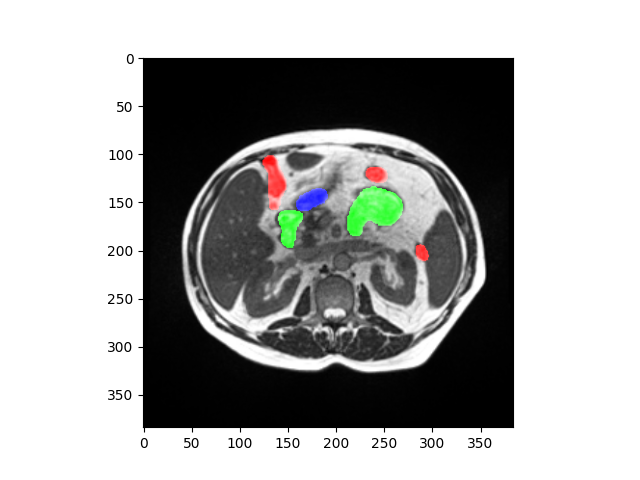
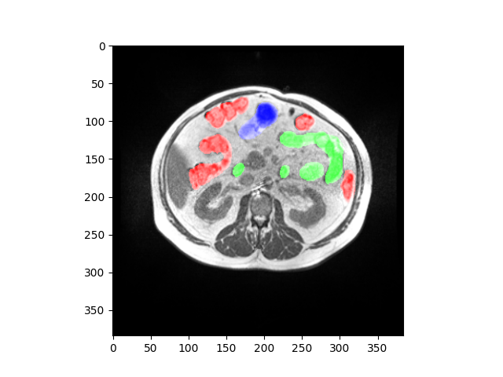
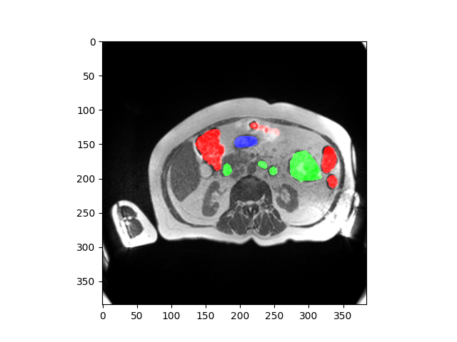

# ***DÖ TÍM***

## Team members:
- Bálint Gergő [O78UXU]
- Juhász Benedek László [C8B5CT]
- Tumai Ádám [Z7MTDT]

## Project Description
Transformer networks revolutionized deep learning, especially in the field of natural language processing, and are gaining much attention in computer vision. They offer great advantages over convolutional networks (CNN), such as higher flexibility, less sensitivity to hyperparameters, and the ability to effectively capture both local and global features in the input data. However, in some cases CNNs still excel, and for some tasks such as segmentation even transformer-based architectures use convolutional layers. 
> Task of the students: explore transformer networks for medical image segmentation. Investigate open-source implementations, find and test a CNN-based baseline solution, and train 1-2 networks with different architectures on a cardiac MRI segmentation dataset (other, even non medica datasets also allowed). Pure-transformer or hybrid transformer-cnn or fully convolutional architectures are ok as well, one must be transformer based. Compare the selected networks by accuracy, throughput, sensitivity to hyperparameter changes, ease of implementation and training, etc. 

### Example images of segmentation:
<table>
  <tr>
    <td><i>RED: Large bowel</i></td>
    <td><i>GREEN: Small bowel</i></td>
    <td><i>BLUE: Stomach</i></td>
  </tr>
  <tr>
    <td></td>
    <td></td>
    <td></td>
  </tr>
 </table>
    
## Files in this repository
- **requirements.txt** -> Contains the requirements of the project with given version numbers.
- **DOCKERFILE** -> Describes the process of the containerization of the solution.
- **main . py** -> The actual version of this file contains the python script of data preprocessing (download, extract, image load)

## Related works
- https://humanheart-project.creatis.insa-lyon.fr/database/#collection/637218c173e9f0047faa00fb 
- https://www.cardiacatlas.org/lv-segmentation-challenge/
- https://github.com/lxtGH/Awesome-Segmentation-With-Transformer#medical-image-segmentation 
- https://github.com/HuCaoFighting/Swin-Unet
- https://arxiv.org/abs/2105.05537 
- https://openaccess.thecvf.com/content/ICCV2021/html/Strudel_Segmenter_Transformer_for_Semantic_Segmentation_ICCV_2021_paper.html

### Difficulty: *Hard*