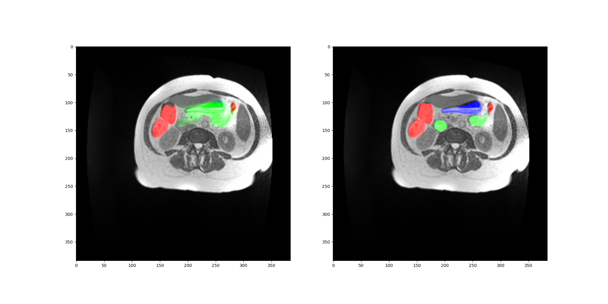
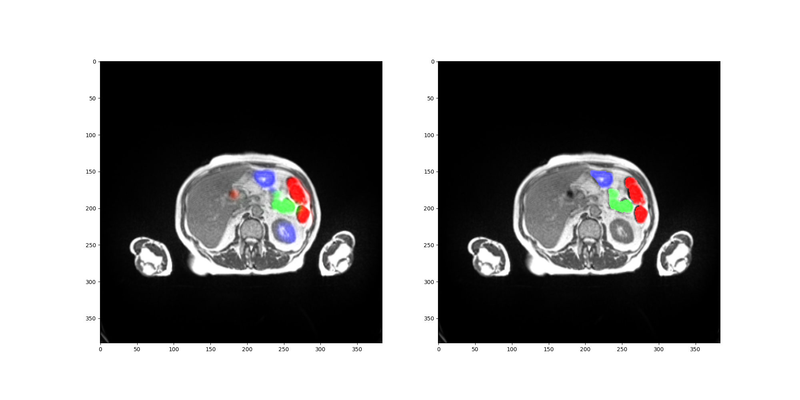

# Deep Learning Homework

> ### Created by: DÖ TÍM
>
> - Bálint Gergő [O78UXU]
> - Juhász Benedek László [C8B5CT]
> - Tumay Ádám [Z7MTDT]

NOTE The project, including the documentation was created with the help of GitHub Copilot.

## Task Description

Transformer networks revolutionized deep learning,
especially in the field of natural language processing,
and are gaining much attention in computer vision.
They offer great advantages over convolutional networks (CNN),
such as higher flexibility, less sensitivity to hyperparameters,
and the ability to effectively capture both local and global features in the input data.
However, in some cases CNNs still excel,
and for some tasks such as segmentation even transformer-based architectures use convolutional layers.

Task of the students:
explore transformer networks for medical image segmentation.
Investigate open-source implementations,
find and test a CNN-based baseline solution,
and train 1-2 networks with different architectures on a cardiac MRI segmentation dataset
(other, even non medica datasets also allowed).
Pure-transformer or hybrid transformer-cnn or fully convolutional architectures are ok as well,
one must be transformer based.
Compare the selected networks by accuracy, throughput, sensitivity to hyperparameter changes,
ease of implementation and training, etc.

## Introduction

In this project we explore the usage of transformer networks for medical image segmentation.

The following works were used as a basis for our experiments:

The baseline:

- [Unet](https://arxiv.org/pdf/1505.04597.pdf)
- [DenseNet](https://arxiv.org/pdf/1608.06993.pdf)
- [DenseUNet](https://ietresearch.onlinelibrary.wiley.com/doi/10.1049/iet-ipr.2019.1527)

The vision transformer:

- [Transformer](https://arxiv.org/pdf/1706.03762.pdf)
- [ViT](https://arxiv.org/pdf/2010.11929.pdf)
- [Segformer](https://arxiv.org/pdf/2105.15203.pdf)

These baseline convolutional architectures use feature pyramids, skip connections and convolutions to tackle
the problem of medical image segmentation.
In order to make the UNet architecture better,
we used ideas from the DenseNet architecture,
and created a hybrid architecture called FancyUNet.
This solution resembles the DenseUNet architecture,
and it leverages the advantages of both the UNet and the DenseNet architectures.
Specifically, dense blocks make the model efficient in terms of memory usage,
and facilitate feature reuse,
while skip connections help the model to learn on different scales of the input data.

<table>
   <tr>
      <td></td>
   </tr>
 </table>

The transformer architectures rely on use feature pyramids, skip connections, attention mechanisms and fully convoluted
layers.
The transformer based architectures use self-attention to capture global features of the input data,
whereas the convolutional architectures use convolutions to capture local features.

Traditionally, transformer networks are used for natural language processing tasks,
however, they are gaining much attention in computer vision.
They offer great advantages over convolutional networks (CNN),
such as higher flexibility, less sensitivity to hyperparameters,
and the ability to effectively capture both local and global features in the input data.

The transformer based architectures are more complex than the convolutional architectures,
and require more computational power to train.
Therefore, we chose to use a pretrained architecture for testing its performance on our task,
though this makes the comparison with the scratch trained convolutional architectures less fair.
The model is available from (HuggingFace)[https://huggingface.co/nvidia/segformer-b2-finetuned-ade-512-512].

<table>
   <tr>
      <td></td>
   </tr>
 </table>

## Dataset

We choose
the [UW-Madison GI Tract Image Segmentation ](https://www.kaggle.com/competitions/uw-madison-gi-tract-image-segmentation)
"Kaggle challenge" dataset for our task.
The dataset contains 50 CT patient's scans.
The 3 segmented organs are large bowel, small bowel and stomach.
We made the dataset available for our project through a Google Drive link.
Note that the raw data contains the CT scans as png images, and the segmentation masks run-length-encoded in a csv file.

## Project structure

- **assets/readme** : Contains the images for the README.md file.
- **build/build_runner.sh** : Contains the commands to build the docker image and run the container.
- **build/Dockerfile** : Describes the process of the containerization of the solution.
- **build/floating_requirements.txt** : Contains the requirements of the project without version numbers.
- **build/frozen_requirements.txt** : Contains the installed requirements of the project with fixed version numbers.
- **build/run.sh** : Contains the commands to run the training.
- **build/kill.sh** : Contains the commands to kill all running containers (useful when early stopping a training).
- **build/main.ipynb** : Contains the code to run the training in Google Colab.
- **lib/dataset.py** : Contains the dataset class and methods related to the dataset.
- **lib/fancy_unet.py** : Contains the implementation of a custom U-Net/Densenet architecture, which served as a
  baseline.
- **lib/main.py** : Contains the entry point of the program.
- **lib/path_util.py** : Contains the path related methods.
- **lib/plot_util.py** : Contains the methods to plot and save the results.
- **lib/segformer.py** : Contains the acquisition of the (pretrained) Segformer architecture, that is the main obejct of
  these experiments.
- **lib/trainer.py** : Contains the Pytorch Lightning trainer logic, that is responsible for the training and validation
  of the models.
- **lib/unet.py** : Contains a U-Net implementation, that was used for sanity checks.

## Usage

### Normal usage

The current version provides the script to create the containerized environment in build/build_runner.sh.
If you want to use the most important packages with fixed version, edit the build/Dockerfile to use the
freezed_requirements.txt.
You can use this environment to run the training/testing script, by running the build/run.sh file.
The required mounts should be added to the container before running: use absolute paths to these folders.

The lib/main.py serves as the entry point of the program.
You can train or evaluate the models by running this file.
If you wish to run the training with different settings,
you can change the passed arguments in the build/startup.sh file, or in colab the main.ipynb file,
as well as changing any of the scripts in the lib folder.

### Debugger usage

Instructions to setup Docker Remote interpreter in PyCharm:

1. Make sure you are using PyCharm Professional Edition,
   and Docker is properly installed,
   as well as the Docker GPU runtime.
2. 'Add new Interpreter' / 'On Docker'
3. Check the built image (melytanulas:latest).
4. Make sure the system interpreter is selected in the last tab.
5. Create a configuration by hitting the Run button next to the main function in the code.
6. It won't run, because the required folders are not mounted yet.
   Under docker container settings pair the required mounts.
   Note, you must use absolute paths here.
7. You might want to remove the previous containers / layers when rerunning with different files.

### Required mounts

- **/out** : The folder contains the output of the preprocessing script, and possibly place for future outputs.
- **/data** : The folder that contains the downloaded and extracted data.
- **/code** : The 'lib' folder of the project. This external dependency makes modifications to the code easy to
  implement.

### Colab Usage

You can execute the training in colab as well, by making necessary modifications to the main.ipynb file.
Make sure you download the dataset before running the training, and modify the `/data` and `/mount` positions.

Add option `--gradio` to run the demo. The demo is ONLY available in colab for technical reasons.
Select a test image from the list, and the corresponding prediction will be displayed, as well as the target image.

### Interactive UI usage

You can use the interactive UI to make predictions on the test set.

TODO finish this section.

# Methods of training

The dataset was resized to 384x384, and the images were normalized into the range of (0, 1), after clipping the
outliers.
We used a traditional train-validation-test split (80-10-10).
We split the cases instead of the images, to avoid data leakage between the splits,
as neighbouring images are very similar to each other.

The architectures' general properties is explained in the introduction section.
Specifically, the baseline model is implemented in the lib/fancy_unet.py file.
The transformer based architectures are implemented in the lib/segformer.py file,
but as it is a pretrained model, the code for building the model from scratch is not included,
however it is in the original repository.

For the transformer, the only non-trained part is the last linear layer as the number of classes in the ImageNet
dataset (1000) is different from the number of classes in our dataset (3).
We chose the model with the closest resolution (512x512 compare to 384x384) to our dataset, as the resolution of the
model is fixed, and usually this yields the best results.

The only non-traditional part of the training is the batch-aggregation.
The batch-aggregation aggregates the gradients of multiple batches before updating the weights of the model.
This is done to reduce the variance of the gradients, and to make the training more stable.

No automatic hyperparameter tuning was used, as the training of the models was already time-consuming.
The hyperparameters were chosen based on the results of the baseline model during training,
including the learning rate, the batch size, the batch aggregation size.
See code for exact parameter values.

We closely monitored the training curves to make sure that the models are capable of learning,
and the validation curves to make sure that the models are generalizing.
We did not run a single-batch-overfitting run, as generalization power was apparent from the beginning.

As with many segmentation tasks we used the dice score as the main metric to evaluate the performance of the models.
However, the loss function is binary cross entropy, as we deemed it is more stable than the dice loss.
Dice score is a metric that describes the overlap between the prediction and the ground truth,
and in many cases is more intuitive than the cross entropy loss, especially for scarce outputs such as masks.

We trained on colab with a T4 GPU.
Connection was interrupted a few times, so the results are not reproducible,
but it seems the convergence was not affected by the interruptions.

# Results

## Metrics on test set

| Model                | Epochs | Dice Score | BCELoss | Average Time Saved - Large Bowel | Average Time Saved -  Saved Small Bowel | Average Time Saved - Saved Stomach |
|----------------------|--------|------------|---------|----------------------------------|-----------------------------------------|------------------------------------| 
| Segformer            | 14     | 0.729      | 0.020   | 2.29                             | 0.45                                    | 0.05                               |
| FancyUnet (baseline) | 6      | 0.681      | 0.025   | 1.35                             | 0.22                                    | -0.62                              |

Our 'complex' evaluation metric approximates the time saved by the radiologist using our network.
If the dice score of a picture is above a certain threshold (see lib/trainer.py),
then we assume that the radiologist would not have to check the segmentation of that picture,
however if the dice score is below the threshold,
then the radiologist would have to spend extra time on checking that picture.

## Analysis of results

The SegFormer model improved on validation until early stopping occurred, and reached a dice score of 0.78 on the
validation set.
However on the test set it performed significantly worse, with a dice score of 0.729.
As we did not hyper-parameter optimizer, this suggests that the inhomogeneity between the validation and test set is
significant.

## Training logs

Note that both experiments have been restarted multiple times,
and where the plot line ends for one run, the next starts on the same epoch.
Note batches are not comparable.

### For SegFormer

<table>
   <tr>
      <td></td>
   </tr>
</table>

### For FancyUnet

<table>
   <tr>
      <td></td>
    </tr>
 </table>

# Conclusion

# Example Gallery

> ### Color labels
>
> *RED* : Large bowel
>
> *GREEN* : Small bowel
>
> *BLUE* : Stomach

## Slices from the dataset

<table>
  <tr>
    <td></td>
    <td></td>
    <td></td>
  </tr>
 </table>

## Test images TODO - replace with new images

Prediction - Ground truth

### FancyUnet

<table>
   <tr>
      <td></td>
   </tr>
   <tr>
      <td></td>
    </tr>
    <tr>
      <td></td>
    </tr>
 </table>

### Segformer

<table>
   <tr>
      <td></td>
   </tr>
   <tr>
      <td></td>
    </tr>
    <tr>
      <td></td>
    </tr>
 </table>

## Test images training sequence (GIF)

### FancyUnet

<table>
    <tr>
        <td></td>
    </tr>
 </table>

### Segformer

<table>
    <tr>
        <td></td>
    </tr>
 </table>

## Demo

<table>
    <tr>
        <td></td>
    </tr>
 </table>