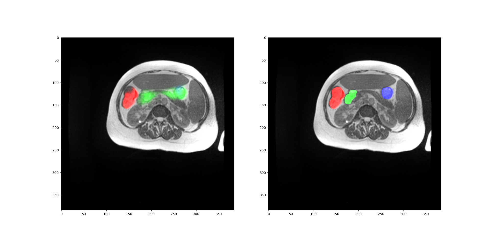

# Deep Learning Homework

> ### Created by: DÖ TÍM
> 
> - Bálint Gergő [O78UXU]
> - Juhász Benedek László [C8B5CT]
> - Tumay Ádám [Z7MTDT]

## Task Description

Transformer networks revolutionized deep learning,
especially in the field of natural language processing,
and are gaining much attention in computer vision.
They offer great advantages over convolutional networks (CNN),
such as higher flexibility, less sensitivity to hyperparameters,
and the ability to effectively capture both local and global features in the input data.
However, in some cases CNNs still excel,
and for some tasks such as segmentation even transformer-based architectures use convolutional layers. 

Task of the students:
explore transformer networks for medical image segmentation.
Investigate open-source implementations,
find and test a CNN-based baseline solution,
and train 1-2 networks with different architectures on a cardiac MRI segmentation dataset
(other, even non medica datasets also allowed).
Pure-transformer or hybrid transformer-cnn or fully convolutional architectures are ok as well,
one must be transformer based.
Compare the selected networks by accuracy, throughput, sensitivity to hyperparameter changes,
ease of implementation and training, etc. 

## Dataset

We choose the [UW-Madison GI Tract Image Segmentation ](https://www.kaggle.com/competitions/uw-madison-gi-tract-image-segmentation)
"Kaggle challenge" dataset for our task.
The dataset contains 50 CT patient's scans.
The 3 segmented organs are large bowel, small bowel and stomach.
We made the dataset available for our project through a Google Drive link.
Note that the raw data contains the CT scans as png images, and the segmentation masks run-length-encoded in a csv file.

## Project structure

### Files in this repository
- **assets/readme** : Contains the images for the README.md file.
- **build/build_runner.sh** : Contains the commands to build the docker image and run the container.
- **build/Dockerfile** : Describes the process of the containerization of the solution.
- **build/floating_requirements.txt** : Contains the requirements of the project without version numbers.
- **build/frozen_requirements.txt** : Contains the installed requirements of the project with fixed version numbers.
- **build/run.sh** : Contains the commands to run the training.
- **build/kill.sh** : Contains the commands to kill all running containers (useful when early stopping a training).
- **build/main.ipynb** : Contains the code to run the training in Google Colab.
- **lib/dataset.py** : Contains the dataset class and methods related to the dataset.
- **lib/fancy_unet.py** : Contains the implementation of a custom U-Net/Densenet architecture, which served as a baseline.
- **lib/main.py** : Contains the entry point of the program.
- **lib/path_util.py** : Contains the path related methods.
- **lib/plot_util.py** : Contains the methods to plot and save the results.
- **lib/segformer.py** : Contains the acquisition of the (pretrained) Segformer architecture, that is the main obejct of these experiments.
- **lib/trainer.py** : Contains the Pytorch Lightning trainer logic, that is responsible for the training and validation of the models.
- **lib/unet.py** : Contains a U-Net implementation, that was used for sanity checks.

## Normal usage

The current version provides the script to create the containerized environment in build/build_runner.sh.
If you want to use the most important packages with fixed version, edit the build/Dockerfile to use the freezed_requirements.txt.
You can use this environment to run the preprocessing script, by running the build/run.sh file.
The required mounts should be added to the container before running: use absolute paths to these folders.

The lib/main.py serves as the entry point of the program.
If you wish to run the training with different settings,
you can change the passed arguments in the build/startup.sh file, or in colab the main.ipynb file,
as well as changing any of the scripts in the lib folder.

### Debugger usage

Instructions to setup Docker Remote interpreter in PyCharm:

1. Make sure you are using PyCharm Professional Edition,
   and Docker is properly installed,
   as well as the Docker GPU runtime.
2. 'Add new Interpreter' / 'On Docker'
3. Check the built image (melytanulas:latest).
4. Make sure the system interpreter is selected in the last tab.
5. Create a configuration by hitting the Run button next to the main function in the code.
6. It won't run, because the required folders are not mounted yet.
   Under docker container settings pair the required mounts.
   Note, you must use absolute paths here.
7. You might want to remove the previous containers / layers when rerunning with different files.

### Required mounts
- **/out** : The folder contains the output of the preprocessing script, and possibly place for future outputs.
- **/data** : The folder that contains the downloaded and extracted data.
- **/code** : The 'lib' folder of the project. This external dependency makes modifications to the code easy to implement.

## Colab Usage

You can execute the training in colab as well, by making necessary modifications to the main.ipynb file.

# Model description

The following works were used as a basis for our experiments.

The baseline:
- [Unet](https://arxiv.org/pdf/1505.04597.pdf)
- [DenseNet](https://arxiv.org/pdf/1608.06993.pdf)
- [DenseUNet](https://ietresearch.onlinelibrary.wiley.com/doi/10.1049/iet-ipr.2019.1527)

The vision transformer:
- [Transformer](https://arxiv.org/pdf/1706.03762.pdf)
- [ViT](https://arxiv.org/pdf/2010.11929.pdf)
- [Segformer](https://arxiv.org/pdf/2105.15203.pdf)

# Preliminary results (see code for parameters of training)

| Model     | Test Dice | Time Saved Large Bowel | Time Saved Small Bowel | Time Saved Stomach |
|-----------|-----------|------------------------|------------------------|--------------------| 
| FancyUnet | 0.000     | 0.000                  |                        |                    |
| Segformer | 0.000     | 0.000                  |                        |                    |

## Test images

### FancyUnet

<table>
  <tr>
    <td></td>
    <td></td>
    <td></td>
  </tr>
 </table>

### Segformer

<table>
  <tr>
    <td></td>
    <td></td>
    <td></td>
  </tr>
 </table>

# Example Gallery

## Slices from the dataset

> ### Color labels
> 
> *RED* : Large bowel
> 
> *GREEN* : Small bowel
> 
> *BLUE* : Stomach

<table>
  <tr>
    <td></td>
    <td></td>
    <td></td>
  </tr>
 </table>
